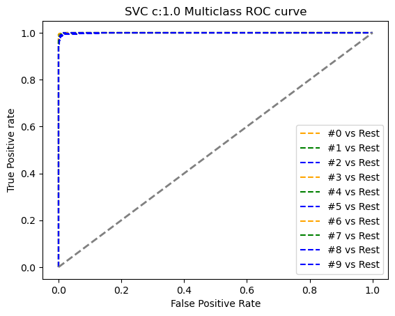
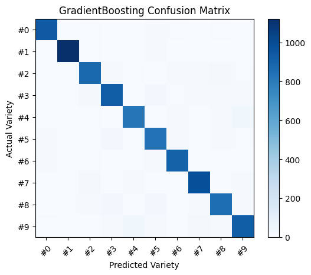
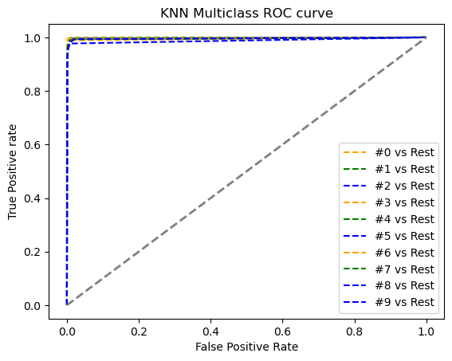
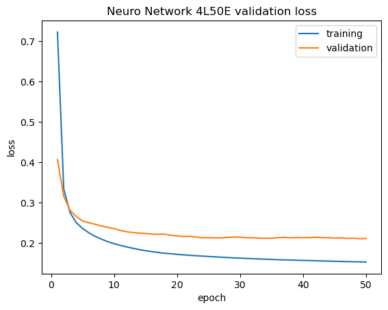
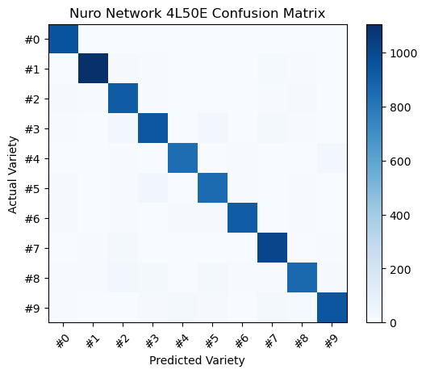
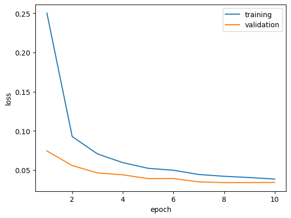
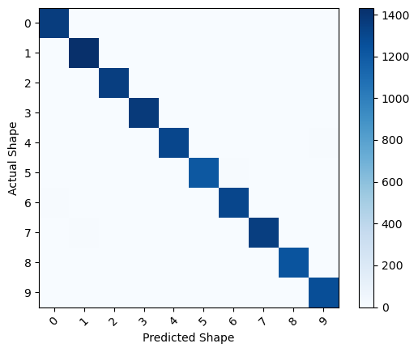
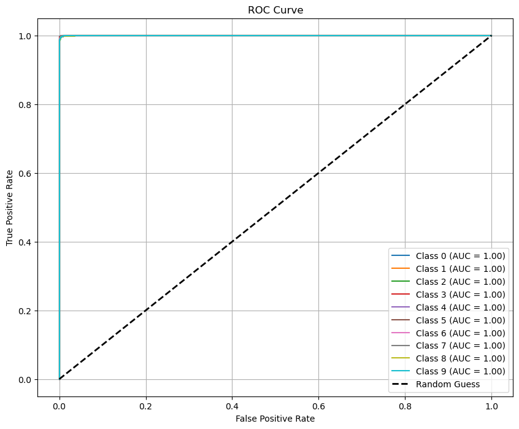
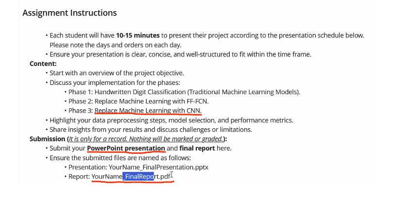

# Seneca Learning Python ML Projects

[toc]

## Project 01 Mint Img Identify Report Data

### Process

#### Features reduction with PCA

​	Retain **95%** variance:

​		Original shape: (70000, 784) 

​		Reduced shape: (70000, 154)

   ### Results

#### **Model: SVC** (24min)

		- Overall Accuracy: 0.9804828973843058
		- Overall Precision: 0.9804612351461678 
		- Overall Recall: 0.9804781260647013

C: 0.5

#### Medel: GradientBoosting  (34min)

>- Overall Accuracy: 0.9225352112676056 
>- Overall Precision: 0.9214866876930081 
>- Overall Recall: 0.9215295347916148

#### Model: KNeighbors (>1s)

> - Overall Accuracy: 0.971327967806841 
>
> - Overall Precision: 0.9721114946400234 
>
> - Overall Recall: 0.9708353000277103

### Tuning

#### Model: KNeighbors (n_neighbors': [2, 3, 4, 5])  /  Best n_neighbors: 3

>- Overall Accuracy: 0.9732394366197183 
>
>- Overall Precision: 0.9737369412969104 
>
>- Overall Recall: 0.9728264641629674

# Nero network

- Overall Accuracy: 0.9408450704225352 
- Overall Precision: 0.9406643476071134 
- Overall Recall: 0.9404085436471942

## CNN

Overall Accuracy: 0.9903007518796992 

Overall Precision: 0.9903219482613392 

Overall Recall: 0.9901177251441858

Hossein pourmodheji

